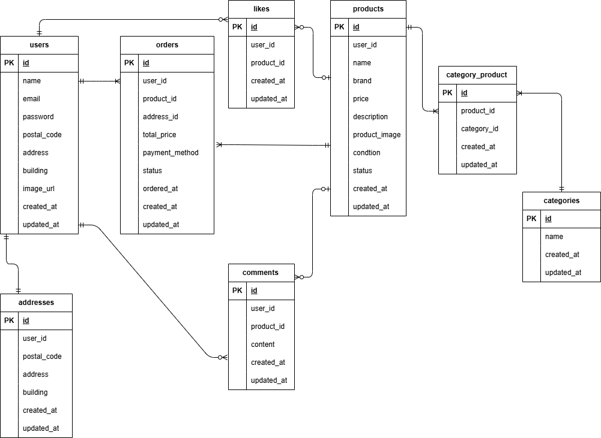

# flea-market-app

フリマアプリ

## 環境構築

### Dockerビルド

```bash
git clone https://github.com/aiwing001/flea-market-app.git
cd flea-market-app
docker-compose up -d --build
```
### Laravel環境構築

```bash
docker-compose exec php bash
composer install
cp .env.example .env
php artisan key:generate
```

### データベース

`.env`を以下のように設定

```env
DB_CONNECTION=mysql
DB_HOST=mysql
DB_PORT=3306
DB_DATABASE=laravel_db
DB_USERNAME=laravel_user
DB_PASSWORD=laravel_pass
```

マイグレーション実行

```bash
php artisan migrate
```

シーディング実行

```bash
php artisan db:seed
```

商品画像表示設定

```bash
php artisan storage:link
```

テスト実行
```bash
php artisan test
```

## 使用技術

- PHP 8.1.34
- Laravel 8.83.8
- Laravel Fortify
- MySQL 8.0.26
- Docker
- nginx 1.21.1
- phpMyAdmin
- Mailhog
- Stripe

## 機能一覧

- 会員登録
- ログイン
- メール認証
- 商品一覧表示
- 商品検索
- 商品詳細表示
- 商品出品
- いいね機能
- コメント機能
- 商品購入
- Stripe決済
- 配送先変更
- マイページ
- プロフィール編集

## ER図



## URL
- 開発環境：http://localhost/
- phpMyAdmin：http://localhost:8080/
- Mailhog：http://localhost:8025/